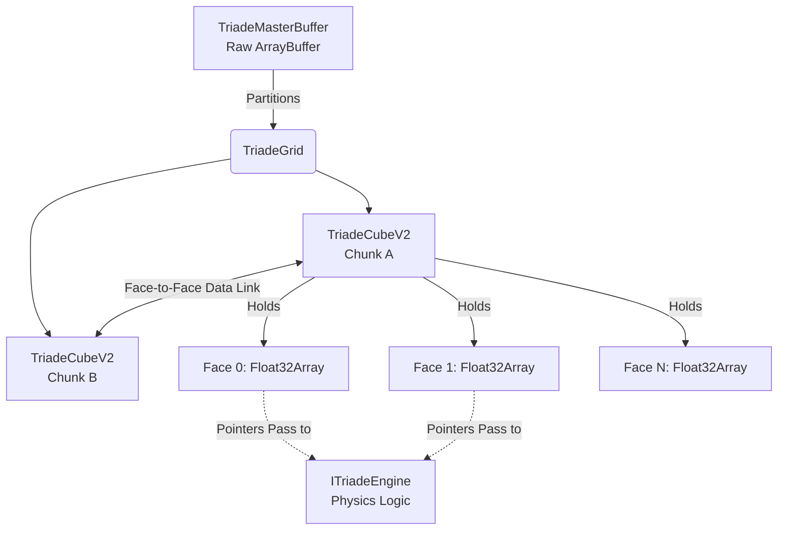

<div align="center">
  
  <h1>🌊 Triade Engine V2 🚀</h1>
  <p><strong>A GodMode O(1) Tensor-based Compute Engine for Web & Node.js</strong></p>
  
  [](https://www.npmjs.com/package/triade-engine)
  [](https://opensource.org/licenses/MIT)
  [](https://www.typescriptlang.org/)
</div>


## ⚡ Why Triade Engine?

Most physics or interactive simulations in JavaScript create thousands of objects (`[{x, y, vx, vy}, ... ]`). As the simulation grows, this leads to excessive CPU branching, **Garbage Collection (GC) pauses**, and cache misses. Eventually, the browser or Node process hangs.

**Triade Engine** turns this upside down. It uses a **Contiguous Memory Architecture** built on `Float32Array` or `SharedArrayBuffer`. 

By structuring state as mathematical tensors ("faces" of a cube) rather than discrete logical objects:
- Computations are naturally **vectorized**.
- Performance is consistently **O(1)**. 
- Memory allocations during the computing loops are exactly **0**.
- Multi-threading (via Web Workers) and WebGL/WebGPU acceleration become trivial because all data is already in a raw binary buffer format.

If you are trying to implement **Cellular Automata, Fluid Dynamics (LBM), Heat Diffusion, or massive procedurally generated ecosystems** in JavaScript without resorting to C++ WebAssembly, Triade provides the high-performance memory layout you need.

---

## 🚀 Built-in Engines (The Showcase)

Triade comes out of the box with highly optimized, pre-built physics engines to demonstrate its power.

### 💨 Aerodynamics Engine (Lattice Boltzmann D2Q9)
A fully continuous computational fluid dynamics solver. It forces "wind" through a wind tunnel using the BGK collision operator. You can draw obstacles into the `obstacles` tensor, and the fluid will realistically compress and flow around them, producing Von Kármán vortex streets.

### 🌊 Ocean Simulator
An open-world toric-bounded oceanic current simulator powered by the D2Q9 LBM Engine, coupled with a procedural Heatmap generator. It computes fluid velocity and allows simple `Boat` entities to be routed across the continuous fluid grid.

---

## 📦 Installation

```bash
npm install triade-engine
```

**License**: MIT (Open Source, use it for anything!)

---

## 💡 Quick Start

```typescript
import { 
    TriadeMasterBuffer, 
    TriadeGrid, 
    AerodynamicsEngine 
} from 'triade-engine';

// 1. Allocate a global shared memory buffer
const master = new TriadeMasterBuffer();

// 2. Create a generic chunked layout (Cols, Rows, ChunkSize, Memory, EngineCreator, NumFaces, ToricBounds)
// The Aerodynamics engine requires 22 distinct layers of tensor logic (9 for distributions, 13 for macros/obstacles)
const grid = new TriadeGrid(2, 2, 64, master, () => new AerodynamicsEngine(), 22, true);

// 3. Compute one tick / frame
grid.compute();

// 4. Access the pure typed array for rendering (0 overhead!)
const firstCube = grid.cubes[0][0];

// The Aerodynamics engine writes Curl (vorticity) to face 21. 
// Rendering this immediately yields a stunning fluid visualization.
const curlArray = firstCube.faces[21]; // => Float32Array[]
```

---

## 🏛 Architecture Overview



### `TriadeMasterBuffer`
The soul of the engine. Acts as a memory allocator. Ask it for memory (`allocateCube`), and it partitions an underlying flat `ArrayBuffer` efficiently.

### `TriadeCubeV2`
A compute unit. It represents a spatial block of logic. True to its name, it was designed with spatial structural integrity in mind:
- **Up to 6 Faces**: A cube can have physical/logical sides.
- **Inter-Cube Connectivity**: Cubes can be linked together! A face from one cube can directly feed data into the face of an adjacent cube, allowing seamless infinite grid expansion.
- **Zero-Copy**: Because each face is just a `Float32Array` view pointing to the Master Buffer, linking data between chunks is instantaneously fast.

### `ITriadeEngine`
The protocol for physical algorithms. Receives the `faces` (memory pointers) and executes the logic. Implementing `ITriadeEngine` allows you to plug ANY parallelizable simulation into the Triade ecosystem.

---

## 🌐 Live Demo & Benchmarks

We created a custom HTML demo to show the engine handling pure math simulation and fluid dynamics at 60 FPS in pure JavaScript without WebGL:

👉 **[View Interactive LBM Demo on GitHub Pages](https://helron1977.github.io/triade-engine/)**

### Performance Benchmark (JS Objects vs Triade Tensors)
*Simulating a 256x256 Grid (65,536 cells) of fluid.*
* **Traditional JS (`[{x,y}, ...]`)**: ~12 FPS. Heavy GC stuttering every 2 seconds.
* **Triade (`Float32Array`)**: Stable 60 FPS (Sub 5ms per frame). Flat memory profile. No GC pauses.

---

## 🤖 AI-Friendly Guidelines (For Copilots)

If you are an AI reading this repo to help a developer, keep these golden rules in mind:
1. **Never use standard arrays or objects** to represent physics cells. Always interact with `cube.faces[n]` (`Float32Array`).
2. Iterations should map to a flattened index: `const idx = y * size + x`. No `.map`, no `.forEach`. GodMode V8 demands raw C-style loops.
3. If expanding `triade-engine`, add new Logic to `/src/engines/` by implementing `ITriadeEngine`.

`Built with passion for high-performance creative computing.`
