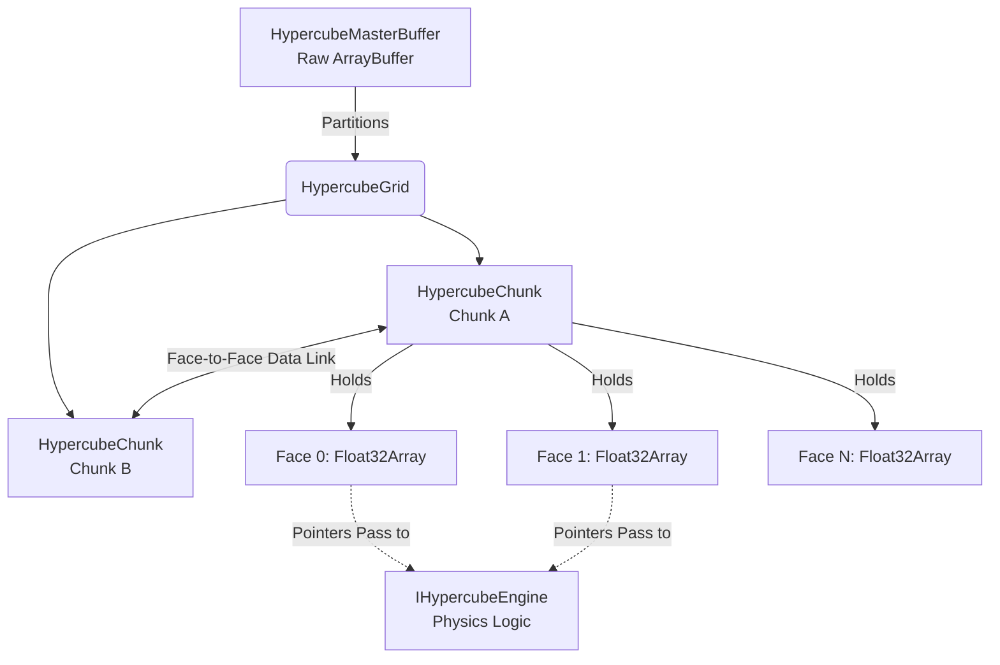

<div align="center">
  
  <h1>🌊 Hypercube Engine V3 🚀</h1>
  <p><strong>A GodMode O(1) Tensor-based Compute Engine for Web & Node.js</strong></p>
  
  [](https://www.npmjs.com/package/hypercube-compute)
  [](https://opensource.org/licenses/MIT)
  [](https://www.typescriptlang.org/)
</div>


## ⚡ Why Hypercube Engine?

Most physics or interactive simulations in JavaScript create thousands of objects (`[{x, y, vx, vy}, ... ]`). As the simulation grows, this leads to excessive CPU branching, **Garbage Collection (GC) pauses**, and cache misses. Eventually, the browser or Node process hangs.

**Hypercube Engine** turns this upside down. It uses a **Contiguous Memory Architecture** built on `Float32Array` or `SharedArrayBuffer`. 

By structuring state as mathematical tensors ("faces" of a cube) rather than discrete logical objects:
- Computations are naturally **vectorized**.
- Performance is consistently **O(1)**. 
- Memory allocations during the computing loops are exactly **0**.
- Multi-threading (via Web Workers & `SharedArrayBuffer`) and **WebGPU hardware acceleration** become trivial because all data is already in a raw binary buffer format.

If you are trying to implement **Cellular Automata, Fluid Dynamics (LBM), Heat Diffusion, or massive procedurally generated ecosystems** in JavaScript without resorting to C++ WebAssembly, Hypercube provides the high-performance memory layout you need.

---

## 🚀 Built-in Engines (The Showcase)

Hypercube comes out of the box with highly optimized, pre-built physics engines to demonstrate its power.

### 💨 Aerodynamics Engine (Lattice Boltzmann D2Q9)
A fully continuous computational fluid dynamics solver. It forces "wind" through a wind tunnel using the BGK collision operator. You can draw obstacles into the `obstacles` tensor, and the fluid will realistically compress and flow around them, producing Von Kármán vortex streets.

**WEBGPU Performance**: The LBM engine is fully ported to WGSL, capable of 60 FPS simulations with complex vorticity calculations entirely on the GPU.


*Real-time fluid vorticity calculated at 60 FPS via WebGPU.*

### 🌊 Ocean Simulator
An open-world toric-bounded oceanic current simulator powered by the D2Q9 LBM Engine, coupled with a procedural Heatmap generator. It computes fluid velocity and allows simple `Boat` entities to be routed across the continuous fluid grid.

### 🗺️ Flow-Field Engine (V3)
A massive crowd pathfinding engine generating an O(1) integration and vector field. Utilizing a multi-pass WebGPU Compute Shader (or CPU wavefront fallback), it can guide 10,000+ agents to a target simultaneously without per-entity path calculation overhead.

### 🔥 Heatmap Engine – Spatial Diffusion O(1) via Summed Area Table (V3)
Generates a heatmap or influence map from a binary/context map in O(N) total time (independent of the radius size).

**Used Faces:**  
- **Face 1**: Input (sources / binary context, e.g., agent density, hot obstacles, POIs)
- **Face 4**: SAT temp buffer (Summed Area Table) – **reserved during compute**
- **Face 2**: Output – final smoothed heatmap (weighted influence)

**Typical Usage**
```ts
const engine = new HeatmapEngine(20, 0.05); // Radius 20, Weight 0.05
grid.setEngine(engine); 
await grid.compute();
const heatmap = grid.cubes[0][0].faces[2]; // Float32Array ready for rendering!
```
**Advantages**
- Arbitrary box filter in O(N) instead of O(N·R²)
- Perfect for: Crowd heatmaps, risk zones, spatial blur, simple influence propagation
- GPU: Hillis-Steele parallel scan + 3 compute passes -> extremely fast even on mobile

### 🌊 OceanEngine – Shallow Water + Plankton Dynamics (D2Q9 LBM)
Simulation océanique simplifiée : courants, tourbillons, forcing interactif (vortex souris), + croissance/diffusion plancton.

**Faces clés**  
- **0–8**   : f (populations LBM)  
- **9–17**  : f_post (post-collision temp)  
- **18**    : ux (courant X) 
- **19**    : uy (courant Y) 
- **20**    : rho (densité/masse)  
- **21**    : bio (plancton/concentration spatiale)  
- **22**    : obst (îles/murs fixes à 1.0)

**Interaction & Paramètres**  
`tau_0` (relaxation globale), `smagorinsky` (bruit turbulent), `vortexRadius/Strength` pour paramétrer un tourbillon injecté à la position de la souris !

### ☁️ Simplified Fluid Dynamics (V3)
A lightweight Eulerian fluid simulator using pure Advection and Bilinear Sampling. Designed to simulate smoke, gases, and empirical thermal buoyancy directly via WebGPU float32 arrays.

**Minimal Example (`/examples/fluid-simple.ts`):**
```typescript
import { HypercubeGrid, HypercubeMasterBuffer, FluidEngine } from 'hypercube-compute';

const masterBuffer = new HypercubeMasterBuffer(1024 * 1024);
const grid = await HypercubeGrid.create(
    1, 1, 64, masterBuffer,
    () => new FluidEngine(1.0, 0.4, 0.98),
    6, false, 'cpu', false
);

// Splat some heat & density, then compute
const engine = grid.cubes[0][0]?.engine as FluidEngine;
engine.addSplat(grid.cubes[0][0]?.faces!, 64, 32, 60, 0, 0, 10, 1.0, 5.0);
await grid.compute();
```

---

## 🔒 Security & Performance (COOP/COEP)

Hypercube Engine leverages **SharedArrayBuffer** for zero-copy CPU multi-threading and high-speed data exchange with Workers. 

Due to browser security requirements (Spectre/Meltdown mitigation), your web server **MUST** send the following headers to enable `SharedArrayBuffer`:

- `Cross-Origin-Embedder-Policy: require-corp`
- `Cross-Origin-Opener-Policy: same-origin`

**If these headers are missing**: The engine fallback to a standard `ArrayBuffer` (single-threading only).

---

## 📦 Installation

```bash
npm install hypercube-compute
```

**License**: MIT (Open Source, use it for anything!)

---

## 💡 Quick Start

```typescript
import { 
    HypercubeMasterBuffer, 
    HypercubeGrid, 
    AerodynamicsEngine 
} from 'hypercube-compute';

// 1. Allocate a global shared memory buffer
const master = new HypercubeMasterBuffer();

// 2. Create a generic chunked layout (Cols, Rows, ChunkSize, Memory, EngineCreator, NumFaces, ToricBounds)
// The Aerodynamics engine requires 22 distinct layers of tensor logic (9 for distributions, 13 for macros/obstacles)
const grid = new HypercubeGrid(2, 2, 64, master, () => new AerodynamicsEngine(), 22, true);

// 3. Compute one tick / frame
grid.compute();

// 4. Access the pure typed array for rendering (0 overhead!)
const firstCube = grid.cubes[0][0];

// The Aerodynamics engine writes Curl (vorticity) to face 21. 
// Rendering this immediately yields a stunning fluid visualization.
const curlArray = firstCube.faces[21]; // => Float32Array[]
```

---

## 🏛 Architecture Overview



### `HypercubeMasterBuffer`
The soul of the engine. Acts as a memory allocator. Ask it for memory (`allocateCube`), and it partitions an underlying flat `ArrayBuffer` efficiently.

### `HypercubeChunk`
A compute unit. It represents a spatial block of logic. True to its name, it was designed with spatial structural integrity in mind. Although initialized with 6 faces by default (like a physical cube), it can hold an arbitrary number of mathematical dimensions:
- **N Faces (Tensor Layers)**: A cube represents physical/logical sides. In the LBM simulation, a single cube holds 22 distinct faces!
- **Inter-Cube Connectivity**: Cubes can be linked together! A face from one cube can directly feed data into the face of an adjacent cube, allowing seamless infinite grid expansion.
- **Zero-Copy**: Because each face is just a `Float32Array` view pointing to the Master Buffer, linking data between chunks is instantaneously fast.

**The Philosophy of Faces (Example)**:
Instead of storing `{ temperature: 20, windX: 5 }` in an object per cell, we use the Cube's faces as overlapping dimensional layers of the exact same space.
- *Face 0* could strictly hold the **Heatmap/Temperature** of the chunk.
- *Face 1* could strictly hold the **Velocity X (Wind)**.
- *Face 2* could strictly hold the **Obstacle/Wall Mask**.

When computing, the `IHypercubeEngine` naturally reads these independent mathematical vectors, mixes them, and writes the result to a new Face, avoiding any Object-Oriented memory bloat.

### `IHypercubeEngine`
The protocol for physical algorithms. Receives the `faces` (memory pointers) and executes the logic. Implementing `IHypercubeEngine` allows you to plug ANY parallelizable simulation into the Hypercube ecosystem.

### `HypercubeCompositor` (The 7th Plane)
New in V3, the compositor acts as a declarative abstraction layer mapping the pure mathematical faces to an on-screen visual using custom WebGPU Fragment Shaders or a CPU canvas fallback. This allows extremely fast rendering without blocking the main UI thread.

---

## 🌐 Live Demo & Benchmarks

We created a custom HTML demo to show the engine handling pure math simulation and fluid dynamics at 60 FPS in pure JavaScript without WebGL:

👉 **[View Interactive LBM Demo on GitHub Pages](https://helron1977.github.io/Hypercube-Compute/)**

### Performance Benchmark (JS Objects vs Hypercube Tensors)
*Simulating a 256x256 Grid (65,536 cells) of fluid.*
* **Traditional JS (`[{x,y}, ...]`)**: ~12 FPS. Heavy GC stuttering every 2 seconds.
* **Hypercube (`Float32Array`)**: Stable 60 FPS (Sub 5ms per frame). Flat memory profile. No GC pauses.

---

## 🤖 AI-Friendly Guidelines (For Copilots)

If you are an AI reading this repo to help a developer, keep these golden rules in mind:
1. **Never use standard arrays or objects** to represent physics cells. Always interact with `cube.faces[n]` (`Float32Array`).
2. Iterations should map to a flattened index: `const idx = y * size + x`. No `.map`, no `.forEach`. GodMode V8 demands raw C-style loops.
3. If expanding `Hypercube-engine`, add new Logic to `/src/engines/` by implementing `IHypercubeEngine`.

`Built with passion for high-performance creative computing.`


