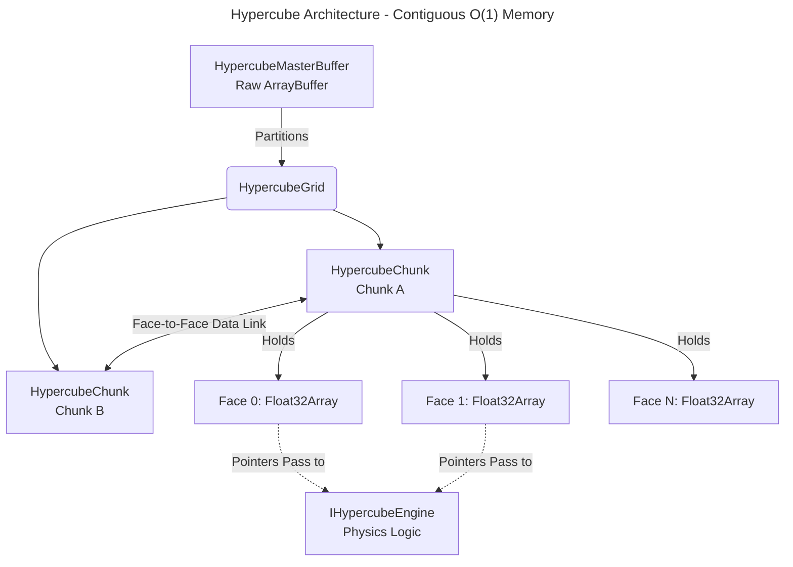

<div align="center">
  
  <h1>🌊 Hypercube Engine V5 🚀</h1>
  <p><strong>A GodMode O(1) Tensor-based Compute Engine for Web & Node.js</strong></p>
  
  [](https://www.npmjs.com/package/hypercube-compute)
  [](https://opensource.org/licenses/MIT)
  [](https://www.typescriptlang.org/)
  [](https://helron1977.github.io/Hypercube-Compute/)
</div>


## ⚡ Why Hypercube Engine?

Most physics or interactive simulations in JavaScript create thousands of objects (`[{x, y, vx, vy}, ... ]`). As the simulation grows, this leads to excessive CPU branching, **Garbage Collection (GC) pauses**, and cache misses. Eventually, the browser or Node process hangs.

**Hypercube Engine** turns this upside down. It uses a **Contiguous Memory Architecture** built on `Float32Array` or `SharedArrayBuffer`. 

By structuring state as mathematical tensors ("faces" of a cube) rather than discrete logical objects:
- Computations are naturally **vectorized**.
- Performance is consistently **O(1)**. 
- Memory allocations during the computing loops are exactly **0**.
- Multi-threading (via Web Workers & `SharedArrayBuffer`) and **WebGPU hardware acceleration** become trivial because all data is already in a raw binary buffer format.

If you are trying to implement **Cellular Automata, Fluid Dynamics (LBM), Heat Diffusion, or massive procedurally generated ecosystems** in JavaScript without resorting to C++ WebAssembly, Hypercube provides the high-performance memory layout you need.

---

## 🚀 Native 3D Compute & High-Level API (V5)

V5 introduces a **Unified Facade** that reduces boilerplate by 90%. You can now bootstrap a multi-chunk, multithreaded 3D simulation in a single line.

### 🔥 Unified Facade
The `Hypercube` class automatically handles:
- **MasterBuffer Allocation**: No more manual memory calculation.
- **Engine Registration**: Instantiation via string IDs (`GrayScottEngine`, `OceanEngine`, etc.).
- **Auto-Rendering**: Detects engine type (2D, 2.5D, 3D) and chooses the best renderer automatically.

### 🎨 5 Premium Showcases
1.  **Aérodynamique 2D** : Simulation LBM avec Karman Vortex.
2.  **Océan 2.5D** : Simulation isovolume isométrique.
3.  **Diffusion Thermique 3D** : Laplacien 3D pur sur >200k cellules.
4.  **Life Ecosystem** : Automate cellulaire à 4 états (Vide, Plante, Herbi, Carni).
5.  **Gray-Scott Organic** : Morphogénèse (Turing patterns / Zèbre).
6.  **V8 Declarative (Pure Heat)** : L'aboutissement [V8 Architecture](./docs/v8-declarative.md). Simulation agnostique du backend (CPU/GPU).

---

## 🏗️ Architecture V8 Declarative (Alpha)
Dernière évolution majeure, le V8 sépare les lois physiques du matériel :
- **Agnosticisme** : Le même code tourne sur CPU (Multithread) ou GPU (WebGPU).
- **Zéro-Effort** : Manipulation sémantique via `Shapes`.
- **Performance** : Pipeline "Zero-Stall" et synchronisation inter-chunks VRAM.

👉 En savoir plus : [Guide de l'architecture V8](./docs/v8-declarative.md)

## 🚀 Built-in Engines (The Showcase)

Hypercube comes out of the box with highly optimized, pre-built physics engines to demonstrate its power.

### 🧪 Gray-Scott Reaction-Diffusion (Organic Turing Patterns)
Simule des phénomènes de morphogénèse (taches de léopard, rayures de zèbre). C’est le test ultime de stabilité numérique pour un solver.
- **Faces** : Face 0 (Substance A), Face 1 (Substance B).
- **Paramètres** : `feed`, `kill`, `Da`, `Db`.

### 💨 Aerodynamics Engine (Lattice Boltzmann D2Q9)
A fully continuous computational fluid dynamics solver. It forces "wind" through a wind tunnel using the BGK collision operator. You can draw obstacles into the `obstacles` tensor, and the fluid will realistically compress and flow around them, producing Von Kármán vortex streets.

**WEBGPU Performance**: The LBM engine is fully ported to WGSL, capable of 60 FPS simulations with complex vorticity calculations entirely on the GPU.


*Real-time fluid vorticity calculated at 60 FPS via WebGPU.*

### 🌊 Ocean Simulator
An open-world toric-bounded oceanic current simulator powered by the D2Q9 LBM Engine, coupled with a procedural Heatmap generator. It computes fluid velocity and allows simple `Boat` entities to be routed across the continuous fluid grid.

### 🗺️ Flow-Field Engine (V3)
A massive crowd pathfinding engine generating an O(1) integration and vector field. Utilizing a multi-pass WebGPU Compute Shader (or CPU wavefront fallback), it can guide 10,000+ agents to a target simultaneously without per-entity path calculation overhead.

### 🧬 GameOfLife Ecosystem (O1 Tile)
Un automate cellulaire repensé en **écosystème organique cyclique (Rock-Paper-Scissors)**.
Les états (Plantes, Herbivores, Carnivores) naissent, survivent ou meurent selon des probabilités stochastiques et des voisinages pondérés (Von Neumann fort, Moore faible).

**Visuel Soft** : En plus de stocker l'état (Face 1), l'écosystème génère continuellement une **carte de densité/âge (Face 3)** allant de `0.0` à `1.0`. Cette matrice peut être envoyée directement au `HeatmapEngine` pour un rendu organique flou et continu, sans l'effet "gros pixels" rigides habituels des Game of Life primitifs.

**Faces clés**
- **Face 1** : L'état discret de l'espèce (0=Vide, 1=Plante, 2=Herbi, 3=Carni).
- **Face 2** : Écriture (Swap internal memory).
- **Face 3** : L'âge ou la densité de masse (0.0 → 1.0) idéale pour les gradients.

### 🔥 Heatmap Engine – Spatial Diffusion O(1) via Summed Area Table (V3)
Generates a heatmap or influence map from a binary/context map in O(N) total time (independent of the radius size).

**Used Faces:**  
- **Face 1**: Input (sources / binary context, e.g., agent density, hot obstacles, POIs)
- **Face 4**: SAT temp buffer (Summed Area Table) – **reserved during compute**
- **Face 2**: Output – final smoothed heatmap (weighted influence)

**Typical Usage**
```ts
const engine = new HeatmapEngine(20, 0.05); // Radius 20, Weight 0.05
grid.setEngine(engine); 
await grid.compute();
const heatmap = grid.cubes[0][0].faces[2]; // Float32Array ready for rendering!
```
**Advantages**
- Arbitrary box filter in O(N) instead of O(N·R²)
- Perfect for: Crowd heatmaps, risk zones, spatial blur, simple influence propagation
- GPU: Hillis-Steele parallel scan + 3 compute passes -> extremely fast even on mobile

### 🌊 OceanEngine – Shallow Water + Plankton Dynamics (D2Q9 LBM)
Simulation océanique simplifiée : courants, tourbillons, forcing interactif (vortex souris), + croissance/diffusion plancton.

**Version V5.4 "Zero-Stall"** :
- **Optimisation GPU** : Passage intégral en WGSL avec gestion de barrières mémoire.
- **Synchronisation VRAM-to-VRAM** : Les échanges de frontières entre chunks se font directement sur le GPU (`copyBufferToBuffer`), éliminant tout readback CPU pendant la simulation.
- **Masse Conservée** : Algorithme validé sur grilles multi-chunks avec conservation parfaite à < 0.1%.

**Faces clés**  
- **0–8**   : f (populations LBM - Entrée/Sortie alternées via Parité)  
- **18**    : ux (courant X) 
- **19**    : uy (courant Y) 
- **20**    : rho (densité/masse)  
- **22**    : obst (îles/murs fixes à 1.0)

### ☁️ Simplified Fluid Dynamics (V3)
A lightweight Eulerian fluid simulator using pure Advection and Bilinear Sampling. Designed to simulate smoke, gases, and empirical thermal buoyancy directly via WebGPU float32 arrays.

**Minimal Example (`/examples/fluid-simple.ts`):**
```typescript
import { HypercubeGrid, HypercubeMasterBuffer, FluidEngine } from 'hypercube-compute';

const masterBuffer = new HypercubeMasterBuffer(1024 * 1024);
const grid = await HypercubeGrid.create(
    1, 1, 64, masterBuffer,
    () => new FluidEngine(1.0, 0.4, 0.98),
    6, false, 'cpu', false
);

// Splat some heat & density, then compute
const engine = grid.cubes[0][0]?.engine as FluidEngine;
engine.addSplat(grid.cubes[0][0]?.faces!, 64, 32, 60, 0, 0, 10, 1.0, 5.0);
await grid.compute();
```

---

## 🔒 Security & Performance (COOP/COEP)

Hypercube Engine leverages **SharedArrayBuffer** for zero-copy CPU multi-threading and high-speed data exchange with Workers. 

Due to browser security requirements (Spectre/Meltdown mitigation), your web server **MUST** send the following headers to enable `SharedArrayBuffer`:

- `Cross-Origin-Embedder-Policy: require-corp`
- `Cross-Origin-Opener-Policy: same-origin`

**If these headers are missing**: The engine fallback to a standard `ArrayBuffer` (single-threading only).

---

## 📦 Installation

```bash
npm install hypercube-compute
```

**License**: MIT (Open Source, use it for anything!)

---

## 💡 Quick Start: See the "Wow" in 10 Lines
The easiest way to start is the **Game of Life** (O1 Ecosystem).

```typescript
import { Hypercube } from 'hypercube-compute';

// 1. Create Grid in 1 line (Multithreaded, 2x2 Chunks)
const grid = await Hypercube.create({
    engine: 'GameOfLifeEngine',
    resolution: 256,
    cols: 2, rows: 2,
    workers: true
});

// 2. Main Loop
const canvas = document.querySelector('canvas')!;
const loop = async () => {
    await grid.compute(); // Distributed computation
    
    // 3. Auto-Rendering (Chooses the best view automatically)
    Hypercube.autoRender(grid, canvas, { faceIndex: 3 }); 
    
    requestAnimationFrame(loop);
};
loop();
```

### 💨 Want Fluid? (Ocean Engine)
To see vortices instead of cells, use the **Ocean Engine**:
```typescript
const grid = await HypercubeGrid.create(1, 1, 256, master, () => new OceanEngine(), 23);

const loop = () => {
    // Sync all LBM populations (Faces 0-8)
    grid.compute([0, 1, 2, 3, 4, 5, 6, 7, 8]); 

    // Render Speed (Velocity Magnitude)
    const ux = grid.cubes[0][0].faces[18]; // Velocity X
    const uy = grid.cubes[0][0].faces[19]; // Velocity Y
    const speed = new Float32Array(ux.length);
    for (let i = 0; i < ux.length; i++) speed[i] = Math.sqrt(ux[i]**2 + uy[i]**2);
    
    HypercubeViz.renderToCanvas(canvas, speed, 256, 256, 'plasma');
    requestAnimationFrame(loop);
};
```

---

## 🏗 Architecture Overview


---

## 🗺️ Engine & Face Dictionary
Hypercube uses **Faces** (tensor layers) instead of objects. Use this table as your "Cheat Sheet":

| Engine | Face | Usage Snippet | Description |
| :--- | :--- | :--- | :--- |
| **GameOfLife** | `1` | `chunk.faces[1]` | **Discrete State** (0=Empty, 1=Plant, 2=Herbi, 3=Carni) |
| | `2` | `chunk.faces[2]` | **Visual Density/Age** (0.0 to 1.0) - Perfect for "soft" renders |
| **Heatmap** | `0` | `chunk.faces[0]` | **Inputs** (binary sources) |
| | `2` | `chunk.faces[2]` | **Result** (Blurred spatial influence map) |
| **Ocean/LBM** | `18` | `chunk.faces[18]` | **Velocity X** (Horizontal current) |
| | `21` | `chunk.faces[21]` | **Curl/Vorticity** (Rotation/Eddies of the fluid) |
| | `22` | `chunk.faces[22]` | **Obstacles** (1.0 = Wall, 0.0 = Fluid) |
| **Vol. Diffusion** | `0` | `chunk.faces[0]` | **Input Concentration** (3D Grid) |

---

## ⚡ Live Interaction & Parameters
**Important**: All parameters can be changed **in live** without rebuilding the grid or the engine.

```typescript
const engine = grid.cubes[0][0].engine as VolumeDiffusionEngine;
engine.diffusionRate = 0.15; // Updated in the next grid.compute()
```

### 🎮 Mouse Interaction
Inject data (vortices, heat, etc.) directly into the tensors:
```typescript
canvas.onmousemove = (e) => {
    const engine = grid.cubes[0][0].engine as OceanEngine;
    engine.addVortex(grid.cubes[0][0].faces, e.offsetX, e.offsetY, 15.0); 
};
```

---

### 🚀 Hardware Acceleration (WebGPU V5.4)

Hypercube auto-détecte le support, mais pour un maximum de performance :

**Pipeline "Zero-Stall"** :
- Les données restent en VRAM pendant toute la durée de la boucle `compute()`.
- **Instrumentation "Robinet"** : Visualisation en temps réel du coût des kernels et des copies VRAM via la console.

```ts
await HypercubeGPUContext.init(); // Indispensable avant de créer la grille
const grid = await HypercubeGrid.create(..., 'gpu'); 
console.log(grid.isGpuReady); // Fallback automatique en 'cpu' si non supporté
```

### � Multi-threading (SharedArrayBuffer)
Requires these server security headers:
- `Cross-Origin-Embedder-Policy: require-corp`
- `Cross-Origin-Opener-Policy: same-origin`

---

## 🌐 Live Demos
👉 **[View Interactive Multi-Engine Demo](https://helron1977.github.io/Hypercube-Compute/)**
- **Switch Engines**: Use the buttons to swap logic.
- **Interact**: Click and drag to create vortices or draw obstacles.
- **3D**: Check the `07-volume-diffusion-3d` example for volumetric rendering.

---

## 🤖 AI-Friendly Guidelines (For Copilots)
1. **Never use standard arrays** for physics. Use `chunk.faces[n]`.
2. Iterations must be flat: `const idx = y * size + x`. No `.map()`.
3. Stick to **GodMode V8** loops (raw C-style) for O(1) efficiency.

`Built with passion for high-performance creative computing.`


