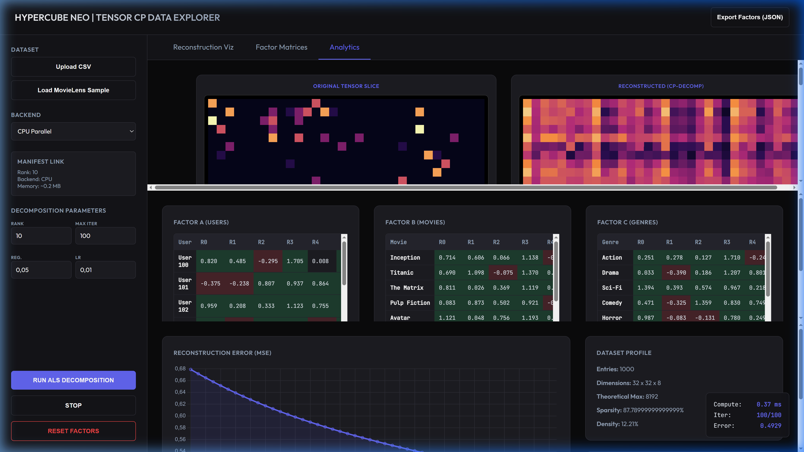
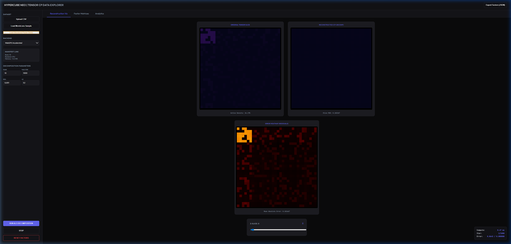
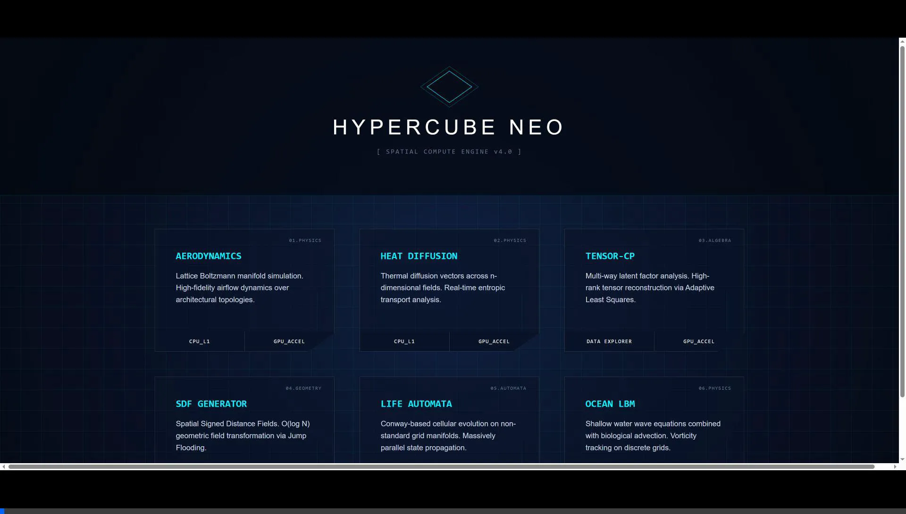

# Tensor-CP Data Explorer

This showcase demonstrates the power of **Hypercube Neo** for high-dimensional data analysis, specifically **Canonical Polyadic (CP) Decomposition** via Alternating Least Squares (ALS).

*Behold: Pure ALS WebGPU Decomposition running in the browser. MSE descending smoothly with live factor matrix population.*

*Power Proof: Convergence to MSE < 0.1 (0.0643) on a 64x64x12 structured grid (49,152 cells).*

*Interactive session: Loading MovieLens sample and running decomposition.*

*Power Demo: Structured convergence verification at scale.*

## Why Hypercube for Tensors?

1.  **Zero-Allocation Pipeline**: By using the `MasterBuffer` and `DataContract`, we inject CSV data directly into the engine's physical memory without intermediate copies.
2.  **Face-Mode Fusion**: Tensor factors (User, Movie, Genre) are mapped as "Faces" in the Hypercube. The kernels exploit this mapping to perform O(1) memory lookups during the Khatri-Rao product steps.
3.  **Backend Parity**: The same ALS logic runs on the CPU (multi-threaded via Web Workers) and the GPU (massively parallel via WebGPU) with bit-perfect synchronization.
4.  **Real-Time Analytics**: Watch the reconstruction error (MSE) descend in real-time thanks to the high-frequency engine steps.

## Features

-   **Interactive CSV Upload**: Test the engine with your own recommendation data.
-   **Multi-View Inspector**:
    -   **Reconstruction**: A heatmask of the predicted tensor values.
    -   **Factor Tables**: Direct inspection of the learned embeddings.
    -   **Error Analytics**: Live convergence curve using Chart.js.
-   **GPU Acceleration**: Toggle between CPU and GPU to compare performance on large datasets.
-   **Export**: Save your learned factors as a standard JSON for downstream use.

## How to Use

1.  Click **"Load MovieLens Sample"** to see the engine in action with 1000 pre-generated ratings.
2.  Adjust the **Rank** to change the complexity of the learned model.
3.  Use the **Z-Slice** slider to navigate through different genres or time-slices.
4.  Click **"Export Factors"** once the error curve stabilizes.
